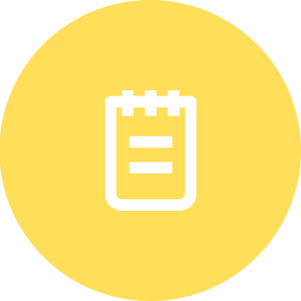

<div align="center">
  
  <h1><code>gnote</code></h1>
  <p>
    <strong>A notetaking and snippet sharing web based application.</strong>
  </p>
</div>

hosted at [note.mrinjamul.in](https://note.mrinjamul.in).

Note: Work in progress.

## Requirements

- [Golang](https://golang.org/dl/)
- [Docker](https://docs.docker.com/get-docker/) (Optional but recommended)
- [Postgresql](https://www.postgresql.org/download/) (**Only if you are not using `docker`**)

### Development

To get started, you can clone the repository and run the following commands:

```bash
git clone https://github.com/mrinjamul/gnote.git
```

To install the dependencies, run the following commands:

```bash
cd gnote
go mod download
```

Copy environment variables file and replace the values with your own.

```bash
cp .env.example .env
```

To run the application, run the following commands:

```bash
export $(cat .env | xargs)
make dev
./gnote
```

To build the application (production), run the following commands:

```bash
make
export $(cat .env | xargs)
./gnote
```

### License

- Backend is open sourced under the [MIT license](LICENSE)
- CLI is open sourced under the [Apache 2 license](cmd/gnote/LICENSE)
